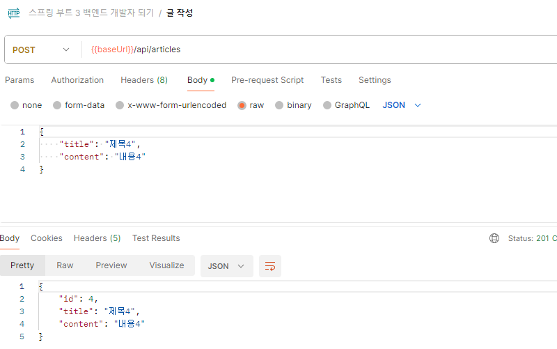
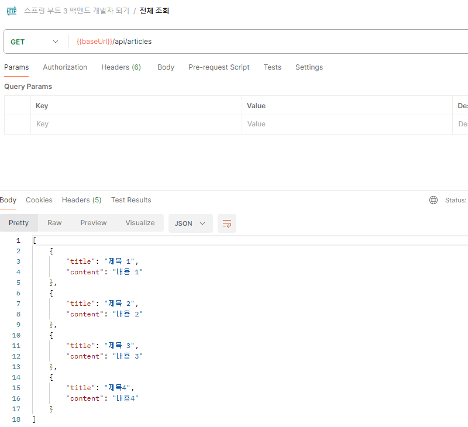
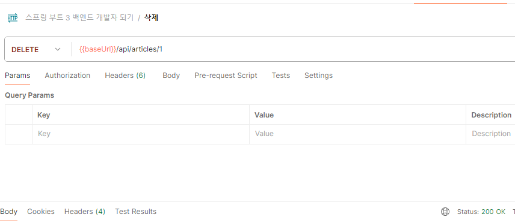
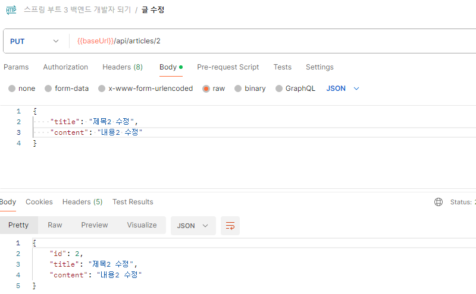
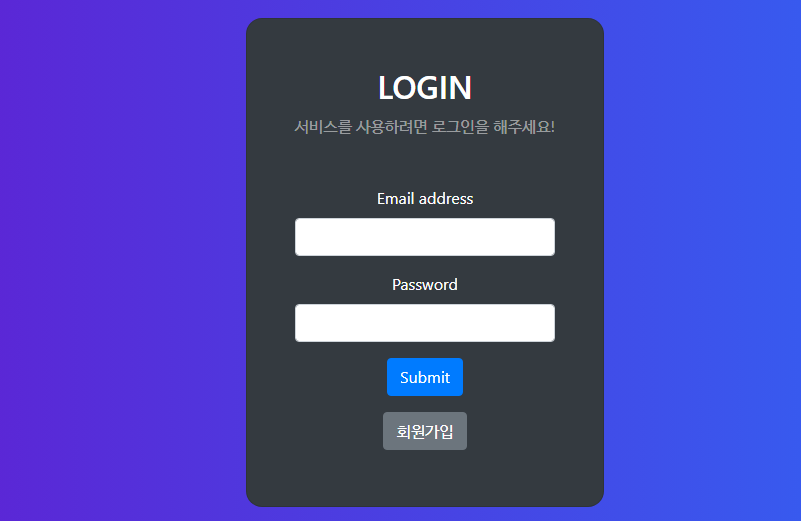
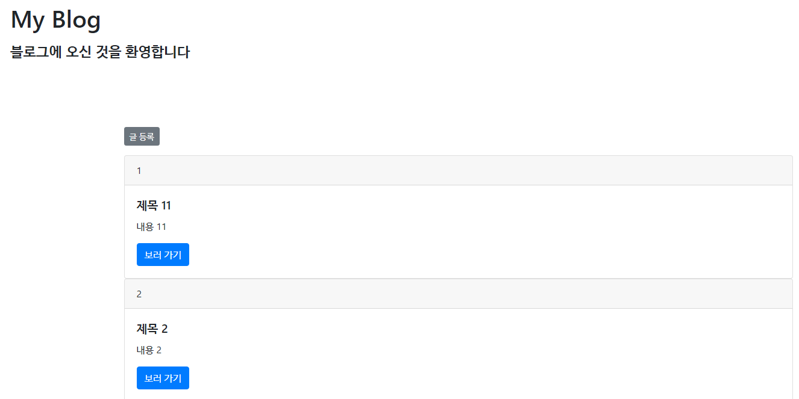
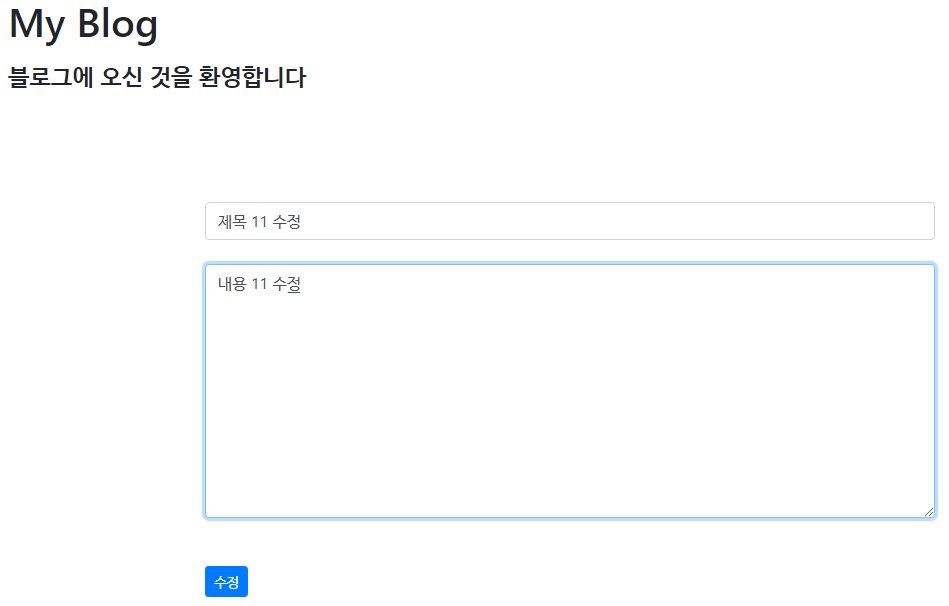

# springbootBoard
 
 - 스프링 부트 3 백엔드 개발자 되기(자바 편) 실습  
 - 블로그 제작 실습
   
 - IDE: IntelliJ  
 - JAVA: 17  
 - DB: mysql  
 - SpringBoot: 3.2.3  
 - Spring Data JPA  
 - Thymeleaf  

---
 

## API 만들기 실습
 

### 💡 글 작성

     

### 💡 전체 조회

     

### 💡 단건 조회

     

### 💡 삭제

     

### 💡 글 수정

     

---
 

## 타임리프 & 스프링 시큐리티 로그인/로그아웃 

### 💡 로그인

     

### 💡 블로그 목록

     

### 💡 상세 화면

     

### 💡 글 수정

       